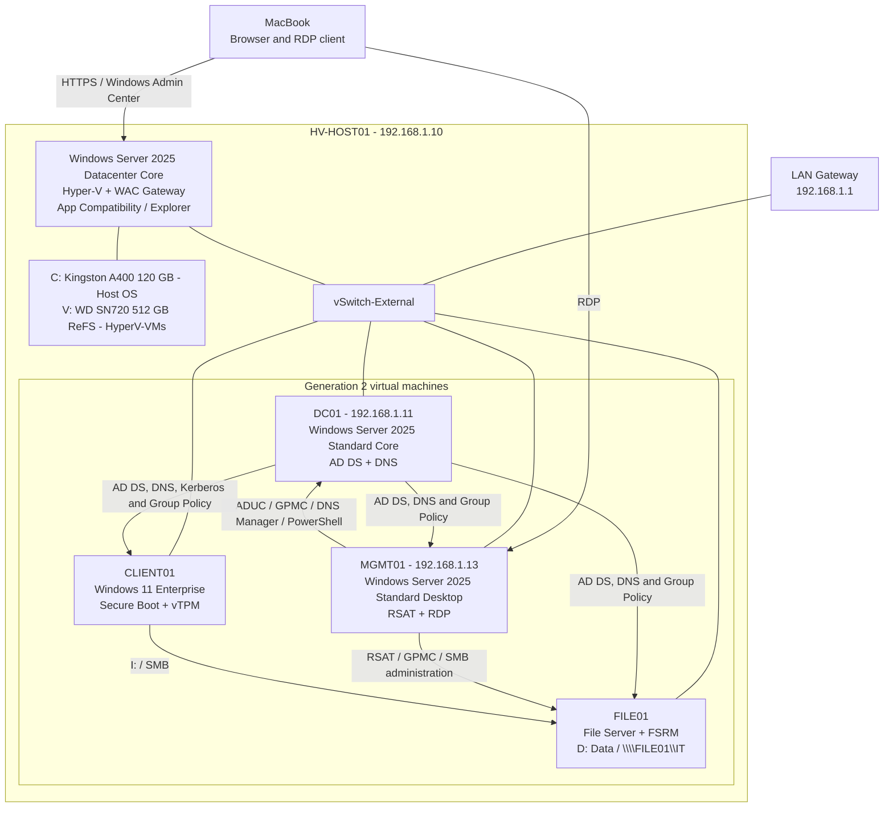
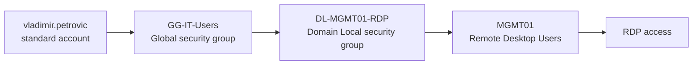

# AZ-802 Windows Server Hybrid Lab

A hands-on Windows Server 2025 homelab built to develop and demonstrate practical skills in identity, virtualization, remote administration, networking, storage, security, troubleshooting, and hybrid infrastructure.

The repository is aligned with AZ-802 subject areas, but it is designed as a professional systems-engineering portfolio rather than an exam-notes repository. Every completed lab records the architecture, implementation commands, validation evidence, troubleshooting process, limitations, and next steps.

## Current Status

The core infrastructure milestone was completed on 4 October 2026. The `FILE01` file-services lab was completed and validated on 6 October 2026. The `CLIENT01` Windows 11 Enterprise deployment and domain-integration lab was completed and validated on 10 October 2026.

| Component | Current state |
|---|---|
| `HV-HOST01` | Windows Server 2025 Datacenter Core; Hyper-V, Windows Admin Center gateway, and Server Core App Compatibility installed |
| Host storage | Kingston A400 120 GB for `C:`; WD SN720 512 GB as `V:` ReFS datastore labelled `HyperV-VMs` |
| Virtual networking | External Hyper-V switch `vSwitch-External`; host management address `192.168.1.10` |
| `DC01` | Windows Server 2025 Standard Core; AD DS and DNS; `192.168.1.11` |
| Directory | Forest/domain `ad.petrovicinfra.com`; NetBIOS name `PETROVIC` |
| `MGMT01` | Windows Server 2025 Standard Desktop Experience; domain joined; RSAT and RDP; `192.168.1.13` |
| `FILE01` | Domain-joined file server in the File Servers OU; dedicated 40 GB dynamic data VHDX; NTFS `D:` volume labelled `Data` |
| `CLIENT01` | Windows 11 Enterprise workstation; Secure Boot and vTPM; joined to the Standard workstation OU; domain logon, Kerberos, GPO, RDP, and file mapping validated |
| Identity | Dedicated standard and privileged accounts, structured OUs, Global and Domain Local security groups |
| File services | `\\FILE01\IT`; AGDLP-controlled SMB/NTFS access; FSRM quota and screening; VSS restore; GPO mapping to `I:` |
| Policy | Domain password/lockout policy, server/user baselines, and `GPO-DriveMap-IT` tested successfully |

Detailed implementation and validation notes are in:

- [Lab 01: Core Infrastructure Foundation](labs/01-active-directory/README.md)
- [Lab 04: FILE01 File Services](labs/04-file-services/README.md)
- [Lab 05: CLIENT01 Windows 11 Enterprise Domain Integration](labs/05-hyper-v/README.md)

## Architecture



## Implemented Identity and Policy Model



The privileged account is separated from daily-use identity:

```text
adm-vpetrovic
    -> GG-Tier0-Admins
        -> Domain Admins
```

The built-in domain Administrator is retained as a recovery account rather than used for routine administration.

## Validated Outcomes

- Hyper-V uses the dedicated ReFS datastore for default VM and VHDX paths.
- The external virtual switch preserves host management connectivity and connects the VMs to the LAN.
- `DC01` hosts the `ad.petrovicinfra.com` forest/domain and AD-integrated DNS.
- AD DS, DNS, Netlogon, NTDS, DFSR, SYSVOL, LDAP SRV records, and local DNS dynamic update were validated.
- The WAC/WinRM DNS issue was traced to an IPv6 DNS path through the router, not to the AD DNS zone.
- A WAC remote `dcdiag` warning was isolated to missing delegated Kerberos credentials; the same secure dynamic-update test passed locally on `DC01`.
- `MGMT01` was joined to the domain and configured with RSAT and RDP.
- `GPO-SRV-Management-Baseline` is applied to `MGMT01`.
- `GPO-User-Baseline` is applied to the standard user; Control Panel, Command Prompt, and Run were confirmed blocked.
- RDP access for the standard user works through the documented group-nesting model.
- `FILE01` is domain joined and placed in `OU=File Servers,OU=Servers,OU=PetrovicInfra,...`.
- A dedicated 40 GB dynamic VHDX provides the NTFS `D:` data volume, separate from the guest operating-system disk.
- `\\FILE01\IT` uses `GG-IT-Users`, `GG-Tier0-Admins`, and the `DL-FILE01-IT-RW/RO/FC` resource groups for AGDLP-based SMB and NTFS authorization.
- FSRM enforces a 5 GB hard quota and an active `Executable Files` file screen; a text file was accepted and an executable file was blocked.
- Shadow Copies are scheduled for `D:` and a Previous Versions restore was completed successfully.
- `GPO-DriveMap-IT` maps `I:` to `\\FILE01\IT` for members of `GG-IT-Users` through item-level targeting.
- `CLIENT01` runs Windows 11 Enterprise with Secure Boot and vTPM, uses `DC01` for domain services, and is joined to the Standard workstation OU.
- `PETROVIC\vladimir.petrovic` signed in to `CLIENT01`; RDP and a valid Kerberos TGT through `DC01.ad.petrovicinfra.com` were confirmed.
- `GPO-User-Baseline` and `GPO-DriveMap-IT` applied on `CLIENT01`; Command Prompt, Run, and Control Panel were blocked, while `I:` provided working access to `\\FILE01\IT` through the existing AGDLP chain.

## Repository Roadmap

| Area | Status | Next evidence |
|---|---|---|
| Core AD domain and CLIENT01 integration | Completed and validated | Continue with the separate AD resilience project: second DC, replication, and DNS redundancy |
| File services | `FILE01` milestone completed and validated | Add the read-only regression test, then continue later with DFS, TrueNAS, and independent backup |
| AD resilience and recovery | Planned | Replication, FSMO, DNS redundancy, and recovery exercises |
| Hyper-V operations | In progress; `CLIENT01` deployment validated | Export/import, recovery, and repeatable inventory |
| Network services and VPN | Next | DHCP authorization, scope, exclusions/reservations, options, and lease testing |
| Security and monitoring | Planned | LAPS, Defender, auditing, Zabbix, and incident exercises |
| Hybrid integration | Planned | Azure Arc and controlled Azure services within budget |
| Backup and disaster recovery | Planned | Measured file, directory, and service restoration |

## Documentation Standards

- Every lab includes prerequisites, architecture, exact commands, validation, troubleshooting, lessons learned, and limitations.
- Results are marked complete only when they have been tested.
- Passwords, tokens, private keys, certificates, public home IP addresses, VM disks, ISO images, and raw sensitive exports are never committed.
- Screenshots are optional supporting evidence; commands and observed outcomes provide the primary technical record.
- This is a homelab. Multiple VMs on one physical host do not demonstrate host-level high availability.

## Next Step

Create a separate Windows workstation security baseline lab, beginning with Windows LAPS, then add Defender Firewall, auditing, local administrator group management, and PowerShell logging. DHCP remains the next planned network-services milestone.
