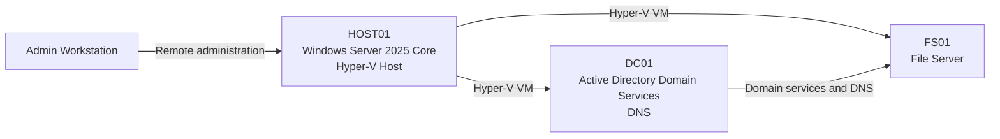

# AZ-802 Windows Server Hybrid Lab

A hands-on homelab for developing and documenting practical skills in Windows Server 2025 and hybrid infrastructure. The project is aligned with AZ-802 subject areas and covers identity, networking, virtualization, storage, security, Azure integration, automation, and disaster recovery.

> **Project status:** Initial repository and architecture setup. Configuration evidence, lab results, and screenshots will be added only after each exercise is completed and validated.

## Planned Architecture



### Core Systems

| System | Planned role |
|---|---|
| Admin Workstation | Secure administration with Windows Admin Center, PowerShell, and remote-management tools |
| HOST01 | Windows Server 2025 Core Hyper-V host |
| DC01 | Active Directory Domain Services and internal DNS |
| FS01 | Domain-joined file server for shares, permissions, and storage labs |

## Domain and DNS Design

- **Public domain:** `petrovicinfra.com`
- **Public DNS provider:** Cloudflare DNS
- **Internal Active Directory domain:** `ad.petrovicinfra.com`
- **Internal DNS:** Hosted on `DC01` and integrated with Active Directory

Public DNS records remain separate from the internal Active Directory DNS namespace. No credentials, API tokens, private keys, private certificates, or other secrets belong in this repository.

## Planned Lab Areas

1. Active Directory Domain Services
2. DNS
3. Group Policy
4. File Services
5. Hyper-V
6. High Availability
7. Hybrid Identity
8. Azure Arc
9. Security and Monitoring
10. Backup and Disaster Recovery

## Repository Structure

```text
.
├── docs/
├── labs/
│   ├── 01-active-directory/
│   ├── 02-dns/
│   ├── 03-group-policy/
│   ├── 04-file-services/
│   ├── 05-hyper-v/
│   ├── 06-high-availability/
│   ├── 07-hybrid-identity/
│   ├── 08-azure-arc/
│   ├── 09-security-monitoring/
│   └── 10-backup-disaster-recovery/
├── scripts/
│   ├── active-directory/
│   ├── file-services/
│   ├── hyper-v/
│   └── azure/
└── diagrams/
```

## Documentation Principles

- Record prerequisites, configuration steps, validation methods, and lessons learned.
- Store reusable PowerShell automation in the appropriate `scripts/` directory.
- Add diagrams when they clarify architecture or traffic flow.
- Publish screenshots and outcomes only after they are produced in the lab.
- Sanitize host details and remove secrets before committing.

## Security and Repository Hygiene

The repository excludes secrets, credentials, private keys and certificates, virtual disks, ISO images, and backup files through `.gitignore`. Any example configuration will use placeholders instead of live values.
