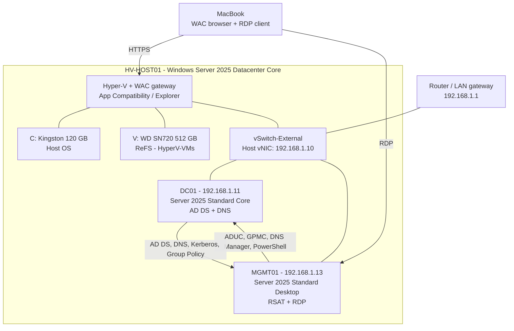
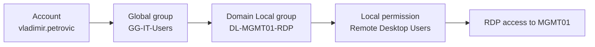

# Lab 01 — Windows Server 2025 Core Infrastructure Foundation

**Date performed:** 4 October 2026  
**Status:** Foundation completed and validated; the wider Core AD project remains in progress  
**Related AZ-802 areas:** AD DS, DNS, Group Policy, Windows Server remote management, Hyper-V, and troubleshooting

## Objective

Build the first operational layer of a Windows Server 2025 homelab:

- a Server Core Hyper-V host with dedicated VM storage and browser-based management;
- an external virtual switch and static address plan;
- a Server Core domain controller providing AD DS and DNS;
- a domain-joined Desktop Experience management server with RSAT and RDP;
- a maintainable OU, account, and group design;
- baseline domain, server, and user policies;
- evidence that DNS, Group Policy, remote management, and group-based RDP access work.

## Business Scenario

A small organization needs a clean Windows Server foundation that can grow into file services, identity resilience, monitoring, security, and hybrid-management exercises. Infrastructure roles should run on Server Core where practical, while administrators use a dedicated management server instead of interactive logon to the domain controller.

The design must separate standard and privileged identities and use group nesting for access. Configuration is not treated as complete until a positive test confirms the intended result.

## Scope

This lab covers the physical Hyper-V host, VM datastore, virtual networking, `DC01`, `MGMT01`, the first AD organizational model, initial security groups and accounts, domain password/lockout settings, two custom GPOs, RDP authorization, and troubleshooting performed during deployment.

It does not yet cover a second domain controller, client VM, DHCP, file services, Azure Arc, JEA, Hyper-V recovery, backup, monitoring, or production-grade high availability.

## Environment

| System | Operating system | Address | Role |
|---|---|---:|---|
| `HV-HOST01` | Windows Server 2025 Datacenter Evaluation, Server Core | `192.168.1.10/24` | Hyper-V host and Windows Admin Center gateway |
| `DC01` | Windows Server 2025 Standard Evaluation, Server Core | `192.168.1.11/24` | AD DS, DNS, Global Catalog, first forest DC |
| `MGMT01` | Windows Server 2025 Standard Evaluation, Desktop Experience | `192.168.1.13/24` | Domain management, RSAT, GPMC, DNS Manager, RDP |
| LAN gateway | Router | `192.168.1.1` | Default gateway |

Directory configuration:

| Setting | Value |
|---|---|
| AD forest/domain | `ad.petrovicinfra.com` |
| NetBIOS name | `PETROVIC` |
| Internal DNS server | `192.168.1.11` (`DC01`) |
| Hyper-V switch | `vSwitch-External` |

Host storage:

| Device | Volume | File system | Purpose |
|---|---|---|---|
| Kingston A400 120 GB | `C:` | NTFS | Host operating system and management components |
| WD SN720 512 GB | `V:` / `HyperV-VMs` | ReFS, 64 KB allocation unit | VM configuration, VHDX, and ISO files |

## Architecture



## Success Criteria

- Host operating system and VM storage are separated.
- Hyper-V defaults point to `V:` and an external switch provides VM connectivity.
- WAC can manage the Server Core host remotely.
- `DC01` provides a functional forest, domain, AD-integrated DNS, SYSVOL, and Netlogon.
- `MGMT01` resolves AD DNS records, joins the domain, and can administer AD/DNS/GPO remotely.
- Standard and privileged identities are separated.
- RDP permission is granted through nested security groups instead of direct user assignment.
- The management-server computer GPO is applied.
- The standard-user GPO blocks Control Panel, Command Prompt, and Run.
- The DNS dynamic-update diagnostic passes locally on `DC01`.

## Evidence Summary

| Evidence area | Confirmed result |
|---|---|
| Hyper-V host | Role installed; host defaults use the dedicated `V:` ReFS datastore |
| Network | External vSwitch operational; all three systems use the documented static address plan |
| Active Directory | `ad.petrovicinfra.com` forest created; AD DS, DNS, Netlogon, DFSR, SYSVOL, and Global Catalog validated |
| DNS | AD-integrated zone and SRV records resolve; the local `dcdiag` dynamic-update test creates and removes its temporary record successfully |
| Management | `MGMT01` joined to the domain; RSAT consoles and RDP access work |
| Identity | Standard and privileged accounts are separated; GG/DL nesting implements role-to-resource access |
| Group Policy | Management baseline applies to `MGMT01`; user baseline blocks Control Panel, Command Prompt, and Run in the test session |
| Troubleshooting | IPv6 DNS selection, WinRM trust, credentials, and the WAC/Kerberos second-hop boundary were identified and documented |

## Security and Safety Notes

- Passwords and the DSRM password were entered interactively and are not present in this repository.
- The built-in domain Administrator was used only for initial bootstrap and retained as a recovery account.
- The normal user and the privileged admin account are separate identities.
- WAC uses HTTPS. A self-signed certificate is acceptable for this isolated lab but is not a production certificate design.
- RDP, WinRM, SMB, WAC, and Hyper-V management are not exposed directly to the internet.
- The checkpoint created before AD DS promotion is a short-term lab rollback point, not a domain-controller backup strategy.
- Private RFC1918 addresses are included to make the lab reproducible; no public home address or secret is documented.

## Implementation

### 1. Prepare the Hyper-V host

Virtualization support was checked before installing Hyper-V:

```powershell
Get-CimInstance Win32_Processor |
Select-Object Name,VirtualizationFirmwareEnabled,SecondLevelAddressTranslationExtensions

systeminfo
```

Hyper-V and its management tools were installed:

```powershell
Install-WindowsFeature -Name Hyper-V -IncludeManagementTools -Restart
```

Validation:

```powershell
Get-WindowsFeature Hyper-V
Get-VMHost
```

### 2. Add Server Core App Compatibility and Windows Admin Center

The App Compatibility Feature on Demand was installed to provide selected local GUI tools such as File Explorer and MMC without converting Server Core to Desktop Experience:

```powershell
Add-WindowsCapability -Online -Name "ServerCore.AppCompatibility~~~~0.0.1.0" -Verbose

Get-WindowsCapability -Online -Name "ServerCore.AppCompatibility~~~~0.0.1.0"

Restart-Computer

Test-Path C:\Windows\explorer.exe
explorer.exe
```

Windows Admin Center was downloaded and installed as a gateway on the host:

```powershell
$parameters = @{
    Source      = "https://aka.ms/WACdownload"
    Destination = "C:\WindowsAdminCenter.exe"
}

Start-BitsTransfer @parameters

Start-Process `
    -FilePath "C:\WindowsAdminCenter.exe" `
    -ArgumentList "/VERYSILENT" `
    -Wait

Get-Service WindowsAdminCenter

Get-NetTCPConnection -State Listen |
Where-Object LocalPort -eq 443

Test-NetConnection localhost -Port 443
```

The gateway was then accessed remotely over HTTPS at the host address.

### 3. Configure the dedicated ReFS VM datastore

The physical disks were identified before any destructive storage action:

```powershell
Get-Disk | Select-Object Number,FriendlyName,SerialNumber,
@{N="SizeGB";E={[math]::Round($_.Size/1GB,1)}},
PartitionStyle,IsBoot,IsSystem
```

After confirming the WD device was not the boot/system disk, it was initialized and formatted. The disk number shown here must always be verified on the target system before reuse:

```powershell
Clear-Disk -Number 1 -RemoveData -RemoveOEM -Confirm:$false
Initialize-Disk -Number 1 -PartitionStyle GPT

New-Partition -DiskNumber 1 -UseMaximumSize -DriveLetter V |
Format-Volume -FileSystem ReFS `
    -NewFileSystemLabel "HyperV-VMs" `
    -AllocationUnitSize 65536 `
    -Confirm:$false
```

The VM folder structure and Hyper-V defaults were configured:

```powershell
New-Item -ItemType Directory -Force -Path `
    "V:\Hyper-V\Virtual Machines",
    "V:\Hyper-V\Virtual Hard Disks",
    "V:\ISO"

Set-VMHost `
    -VirtualMachinePath "V:\Hyper-V\Virtual Machines" `
    -VirtualHardDiskPath "V:\Hyper-V\Virtual Hard Disks"

Get-VMHost |
Select-Object VirtualMachinePath,VirtualHardDiskPath
```

### 4. Create the external Hyper-V switch

The switch was created from the local console because host connectivity can briefly drop while the physical NIC is rebound:

```powershell
Get-NetAdapter
Get-VMSwitch

New-VMSwitch `
    -Name "vSwitch-External" `
    -NetAdapterName "Ethernet" `
    -AllowManagementOS $true

Get-NetIPConfiguration
```

Windows moved the host configuration to `vEthernet (vSwitch-External)`. The management address remained `192.168.1.10/24`, with gateway `192.168.1.1`.

### 5. Deploy and promote DC01

`DC01` was created as a Generation 2 VM with 2 vCPU, Dynamic Memory (1–4 GB, 2 GB startup), a 60 GB dynamically expanding VHDX, Secure Boot, `vSwitch-External`, and automatic checkpoints disabled.

After installing Windows Server 2025 Standard Core, the server was renamed, assigned `192.168.1.11/24`, patched, and given a production checkpoint before AD DS promotion.

The role and forest were installed with:

```powershell
Install-WindowsFeature AD-Domain-Services -IncludeManagementTools

Get-WindowsFeature AD-Domain-Services

Install-ADDSForest `
    -DomainName "ad.petrovicinfra.com" `
    -DomainNetbiosName "PETROVIC" `
    -InstallDNS
```

After promotion and restart, the DC was configured to use itself for DNS:

```powershell
Set-DnsClientServerAddress `
    -InterfaceAlias "Ethernet" `
    -ServerAddresses 192.168.1.11

Get-DnsClientServerAddress -InterfaceAlias "Ethernet" -AddressFamily IPv4
```

### 6. Correct host DNS resolution and validate WinRM

The host's IPv4 DNS client was pointed to the AD DNS server:

```powershell
Set-DnsClientServerAddress `
    -InterfaceAlias "vEthernet (vSwitch-External)" `
    -ServerAddresses 192.168.1.11
```

An IPv6 DNS server learned from the router (`fe80::1`) caused unqualified resolver selection to return public Cloudflare addresses for the internal DC name. The IPv6 binding was disabled on the host management vNIC for this IPv4-only lab:

```powershell
Disable-NetAdapterBinding `
    -Name "vEthernet (vSwitch-External)" `
    -ComponentID ms_tcpip6

Get-NetAdapterBinding `
    -Name "vEthernet (vSwitch-External)" `
    -ComponentID ms_tcpip6

Clear-DnsClientCache

Resolve-DnsName DC01.ad.petrovicinfra.com
Test-WSMan DC01.ad.petrovicinfra.com
```

Because `HV-HOST01` was still in a workgroup, the DC was also configured as an explicit WinRM trusted target:

```powershell
Set-Item WSMan:\localhost\Client\TrustedHosts `
    -Value "DC01.ad.petrovicinfra.com" `
    -Force

Get-Item WSMan:\localhost\Client\TrustedHosts
```

WAC management credentials were changed from the host-local account to `PETROVIC\Administrator` for the DC connection.

### 7. Validate DC01 health

The following commands were used during health validation:

```powershell
Get-DnsClientServerAddress -AddressFamily IPv4

Get-ADDomain |
Select-Object DNSRoot,NetBIOSName,DomainMode,PDCEmulator,RIDMaster,InfrastructureMaster

Get-ADForest |
Select-Object RootDomain,ForestMode,SchemaMaster,DomainNamingMaster

Get-Service NTDS,DNS,Netlogon,DFSR

net share

dcdiag /q

dcdiag /test:Advertising /test:SysVolCheck /test:NetLogons /test:DNS

Resolve-DnsName _ldap._tcp.dc._msdcs.ad.petrovicinfra.com -Type SRV

Get-ADDomainController -Identity DC01 |
Select-Object HostName,IPv4Address,IsGlobalCatalog

Get-DnsServerZone -Name "ad.petrovicinfra.com" |
Format-List ZoneName,ZoneType,IsDsIntegrated,DynamicUpdate,ReplicationScope

Get-DnsServerResourceRecord `
    -ZoneName "ad.petrovicinfra.com" `
    -Name "DC01"

ipconfig /registerdns
Restart-Service Netlogon
```

The detailed dynamic-update test was executed locally on `DC01`:

```powershell
whoami
klist
dcdiag /test:DNS /DnsDynamicUpdate /v
```

It successfully created and deleted the temporary `dcdiag-test-record`; all DNS tests passed.

### 8. Deploy MGMT01 and install RSAT

`MGMT01` was created as a Generation 2 VM with 2 vCPU, Dynamic Memory (2–6 GB, 4 GB startup), a 60 GB dynamically expanding VHDX, Secure Boot, `vSwitch-External`, and automatic checkpoints disabled.

It was installed with Windows Server 2025 Standard Desktop Experience and configured with:

```text
Address:  192.168.1.13/24
Gateway:  192.168.1.1
DNS:      192.168.1.11
```

Before domain join, DNS discovery was validated:

```powershell
Resolve-DnsName DC01.ad.petrovicinfra.com
Resolve-DnsName _ldap._tcp.dc._msdcs.ad.petrovicinfra.com -Type SRV
```

The server was renamed and joined to the domain:

```powershell
Rename-Computer -NewName "MGMT01" -Restart

Add-Computer `
    -DomainName "ad.petrovicinfra.com" `
    -Credential "PETROVIC\Administrator" `
    -Restart
```

RSAT components were installed:

```powershell
Install-WindowsFeature `
    RSAT-AD-Tools, `
    GPMC, `
    RSAT-DNS-Server, `
    RSAT-Hyper-V-Tools, `
    RSAT-DHCP `
    -IncludeAllSubFeature

Get-WindowsFeature `
    RSAT-AD-Tools,GPMC,RSAT-DNS-Server,RSAT-Hyper-V-Tools,RSAT-DHCP
```

The management consoles were launched with:

```powershell
dsa.msc
gpmc.msc
dnsmgmt.msc
virtmgmt.msc
dsac.exe
```

RDP and its firewall rules were enabled:

```powershell
Set-ItemProperty `
    "HKLM:\System\CurrentControlSet\Control\Terminal Server" `
    -Name fDenyTSConnections `
    -Value 0

Enable-NetFirewallRule -DisplayGroup "Remote Desktop"
```

### 9. Build the OU structure

The OU creation function is idempotent at one level: it checks for an existing OU before creating it.

```powershell
Import-Module ActiveDirectory

$DomainDN = (Get-ADDomain).DistinguishedName

function Ensure-OU {
    param(
        [string]$Name,
        [string]$Path
    )

    $ExistingOU = Get-ADOrganizationalUnit `
        -Filter "Name -eq '$Name'" `
        -SearchBase $Path `
        -SearchScope OneLevel `
        -ErrorAction SilentlyContinue

    if (-not $ExistingOU) {
        New-ADOrganizationalUnit `
            -Name $Name `
            -Path $Path `
            -ProtectedFromAccidentalDeletion $true

        Write-Host "Created OU: $Name"
    }
    else {
        Write-Host "Already exists: $Name"
    }
}

Ensure-OU -Name "PetrovicInfra" -Path $DomainDN
$RootOU = "OU=PetrovicInfra,$DomainDN"

Ensure-OU -Name "Admin"            -Path $RootOU
Ensure-OU -Name "Users"            -Path $RootOU
Ensure-OU -Name "Groups"           -Path $RootOU
Ensure-OU -Name "Workstations"     -Path $RootOU
Ensure-OU -Name "Servers"          -Path $RootOU
Ensure-OU -Name "Disabled Objects" -Path $RootOU

$AdminOU = "OU=Admin,$RootOU"
Ensure-OU -Name "Privileged Accounts" -Path $AdminOU
Ensure-OU -Name "Service Accounts"    -Path $AdminOU

$UsersOU = "OU=Users,$RootOU"
Ensure-OU -Name "IT"      -Path $UsersOU
Ensure-OU -Name "HR"      -Path $UsersOU
Ensure-OU -Name "Finance" -Path $UsersOU
Ensure-OU -Name "Sales"   -Path $UsersOU

$GroupsOU = "OU=Groups,$RootOU"
Ensure-OU -Name "Global"       -Path $GroupsOU
Ensure-OU -Name "Domain Local" -Path $GroupsOU
Ensure-OU -Name "Universal"    -Path $GroupsOU

$WorkstationsOU = "OU=Workstations,$RootOU"
Ensure-OU -Name "Standard"           -Path $WorkstationsOU
Ensure-OU -Name "Admin Workstations" -Path $WorkstationsOU

$ServersOU = "OU=Servers,$RootOU"
Ensure-OU -Name "Management"     -Path $ServersOU
Ensure-OU -Name "File Servers"   -Path $ServersOU
Ensure-OU -Name "Member Servers" -Path $ServersOU

$DisabledOU = "OU=Disabled Objects,$RootOU"
Ensure-OU -Name "Users"     -Path $DisabledOU
Ensure-OU -Name "Computers" -Path $DisabledOU

$MgmtOU = "OU=Management,OU=Servers,OU=PetrovicInfra,$DomainDN"

Get-ADComputer "MGMT01" |
Move-ADObject -TargetPath $MgmtOU
```

The final structure was reviewed with:

```powershell
Get-ADOrganizationalUnit `
    -Filter * `
    -SearchBase "OU=PetrovicInfra,$DomainDN" |
Select-Object Name,DistinguishedName |
Sort-Object DistinguishedName
```

### 10. Create groups and separate standard and privileged accounts

```powershell
Import-Module ActiveDirectory

$DomainDN = (Get-ADDomain).DistinguishedName
$GlobalGroupsOU = "OU=Global,OU=Groups,OU=PetrovicInfra,$DomainDN"

New-ADGroup `
    -Name "GG-IT-Users" `
    -SamAccountName "GG-IT-Users" `
    -GroupCategory Security `
    -GroupScope Global `
    -Path $GlobalGroupsOU `
    -Description "Standard IT user accounts"

New-ADGroup `
    -Name "GG-Tier0-Admins" `
    -SamAccountName "GG-Tier0-Admins" `
    -GroupCategory Security `
    -GroupScope Global `
    -Path $GlobalGroupsOU `
    -Description "Privileged Tier 0 Active Directory administrators"

Add-ADGroupMember `
    -Identity "Domain Admins" `
    -Members "GG-Tier0-Admins"
```

Passwords were captured securely and never written to the script:

```powershell
$UserPassword = Read-Host "Password for vladimir.petrovic" -AsSecureString

New-ADUser `
    -Name "Vladimir Petrovic" `
    -GivenName "Vladimir" `
    -Surname "Petrovic" `
    -SamAccountName "vladimir.petrovic" `
    -UserPrincipalName "vladimir.petrovic@ad.petrovicinfra.com" `
    -Path "OU=IT,OU=Users,OU=PetrovicInfra,$DomainDN" `
    -AccountPassword $UserPassword `
    -Enabled $true `
    -ChangePasswordAtLogon $false

Add-ADGroupMember `
    -Identity "GG-IT-Users" `
    -Members "vladimir.petrovic"

$AdminPassword = Read-Host "Password for adm-vpetrovic" -AsSecureString

New-ADUser `
    -Name "Vladimir Petrovic - Admin" `
    -GivenName "Vladimir" `
    -Surname "Petrovic" `
    -SamAccountName "adm-vpetrovic" `
    -UserPrincipalName "adm-vpetrovic@ad.petrovicinfra.com" `
    -Path "OU=Privileged Accounts,OU=Admin,OU=PetrovicInfra,$DomainDN" `
    -AccountPassword $AdminPassword `
    -Enabled $true `
    -ChangePasswordAtLogon $false `
    -Description "Privileged Tier 0 administrative account"

Add-ADGroupMember `
    -Identity "GG-Tier0-Admins" `
    -Members "adm-vpetrovic"
```

The standard account initially remained disabled because its password had not been accepted. It was corrected and validated with:

```powershell
Get-ADUser vladimir.petrovic -Properties Enabled,PasswordLastSet |
Select-Object Name,Enabled,PasswordLastSet

$pw = Read-Host "New password for vladimir.petrovic" -AsSecureString

Set-ADAccountPassword `
    -Identity "vladimir.petrovic" `
    -NewPassword $pw `
    -Reset

Enable-ADAccount -Identity "vladimir.petrovic"
```

Membership and the privileged token were checked after a full sign-out/sign-in:

```powershell
Get-ADGroupMember "GG-Tier0-Admins"
Get-ADGroupMember "Domain Admins"
whoami
whoami /groups
```

### 11. Configure domain password and lockout policy

The Default Domain Policy was used only for domain account policy. The following values were configured in GPMC:

```text
Password history:                  24 passwords
Maximum password age:             90 days
Minimum password age:             1 day
Minimum password length:          14 characters
Password complexity:              Enabled
Reversible encryption:            Disabled

Account lockout threshold:        5 invalid attempts
Account lockout duration:         15 minutes
Reset lockout counter after:      15 minutes
```

Validation commands:

```powershell
Get-ADDefaultDomainPasswordPolicy
net accounts /domain
```

### 12. Configure and test the management-server GPO

The GPO was created and linked only to the Management OU:

```powershell
Import-Module ActiveDirectory
Import-Module GroupPolicy

$DomainDN = (Get-ADDomain).DistinguishedName
$MgmtOU = "OU=Management,OU=Servers,OU=PetrovicInfra,$DomainDN"

Get-ADComputer MGMT01 -Properties DistinguishedName |
Select-Object Name,DistinguishedName

New-GPO `
    -Name "GPO-SRV-Management-Baseline" `
    -Comment "Security baseline for management servers"

New-GPLink `
    -Name "GPO-SRV-Management-Baseline" `
    -Target $MgmtOU `
    -LinkEnabled Yes

Get-GPInheritance -Target $MgmtOU
```

The following computer settings were configured through GPMC:

| Setting | Value |
|---|---|
| Require NLA for Remote Desktop Services | Enabled |
| Interactive logon: Machine inactivity limit | 900 seconds |
| Accounts: Guest account status | Disabled |
| Advanced Audit Policy / Logon / Audit Logon | Success and Failure |

The policy was refreshed and confirmed:

```powershell
gpupdate /target:computer /force
gpresult /r /scope computer

New-Item C:\Temp -ItemType Directory -Force
gpresult /h C:\Temp\MGMT01-GPO.html /f
Start-Process C:\Temp\MGMT01-GPO.html
```

`GPO-SRV-Management-Baseline` appeared under Applied Group Policy Objects.

### 13. Configure and test the standard-user GPO

```powershell
Import-Module GroupPolicy
Import-Module ActiveDirectory

$DomainDN = (Get-ADDomain).DistinguishedName
$UsersOU = "OU=Users,OU=PetrovicInfra,$DomainDN"

New-GPO `
    -Name "GPO-User-Baseline" `
    -Comment "Baseline settings for standard domain users"

New-GPLink `
    -Name "GPO-User-Baseline" `
    -Target $UsersOU `
    -LinkEnabled Yes
```

The following User Configuration settings were enabled through GPMC:

| Path | Setting |
|---|---|
| Control Panel | Prohibit access to Control Panel and PC settings |
| System | Prevent access to the command prompt |
| Start Menu and Taskbar | Remove Run menu from Start Menu |

Validation:

```powershell
gpupdate /force
gpresult /r /scope user
```

After signing in as `PETROVIC\vladimir.petrovic`, Control Panel, Command Prompt, and Run were all confirmed blocked. The privileged account is outside the Users OU and was not affected by this user policy.

### 14. Grant RDP access through group nesting

The standard user initially lacked RDP logon rights. A Domain Local resource group was created and nested according to the AGDLP model:

```powershell
Import-Module ActiveDirectory

$DomainDN = (Get-ADDomain).DistinguishedName
$DLOU = "OU=Domain Local,OU=Groups,OU=PetrovicInfra,$DomainDN"

New-ADGroup `
    -Name "DL-MGMT01-RDP" `
    -SamAccountName "DL-MGMT01-RDP" `
    -GroupCategory Security `
    -GroupScope DomainLocal `
    -Path $DLOU `
    -Description "Users allowed to RDP to MGMT01"

Add-ADGroupMember `
    -Identity "DL-MGMT01-RDP" `
    -Members "GG-IT-Users"

Add-LocalGroupMember `
    -Group "Remote Desktop Users" `
    -Member "PETROVIC\DL-MGMT01-RDP"

Get-LocalGroupMember "Remote Desktop Users"
gpupdate /force
```

The final access chain is:



RDP logon was retested successfully with the standard account.

## Validation and Results

| Test | Expected result | Observed result | Status |
|---|---|---|---|
| Hyper-V role | Installed; `Get-VMHost` returns host data | Confirmed | PASS |
| App Compatibility | Capability installed; `explorer.exe` available | Explorer and Control Panel opened | PASS |
| WAC gateway | HTTPS listener and remote browser access | WAC managed `HV-HOST01` | PASS |
| VM storage paths | Both defaults under `V:\Hyper-V` | Confirmed by `Get-VMHost` | PASS |
| External switch | Host retains `.10`; VMs reach LAN | Confirmed | PASS |
| AD forest/domain | `ad.petrovicinfra.com` on `DC01` | Confirmed | PASS |
| Core services | NTDS, DNS, Netlogon, DFSR running | Confirmed | PASS |
| SYSVOL/NETLOGON | Both shares exist | Confirmed | PASS |
| AD DNS SRV record | LDAP SRV target is `DC01` | Confirmed | PASS |
| DNS zone | AD integrated, secure dynamic updates | Confirmed | PASS |
| DNS dynamic update | Test record created and deleted | Passed locally on `DC01` | PASS |
| MGMT01 domain join | Domain logon and AD management work | Confirmed | PASS |
| RSAT | ADUC, GPMC, DNS and Hyper-V tools installed | Confirmed | PASS |
| Privileged identity | Admin token contains nested admin groups | Confirmed after re-logon | PASS |
| Computer GPO | Management baseline listed as applied | Confirmed | PASS |
| User GPO | Control Panel, CMD, and Run unavailable | All three blocked | PASS |
| RDP authorization | Standard user connects through group nesting | Confirmed | PASS |

## Troubleshooting

### Public DNS answers returned for the internal DC

**Symptom:** `Resolve-DnsName DC01.ad.petrovicinfra.com` from the host returned public Cloudflare addresses, and WAC/WinRM targeted the wrong endpoint.

**Evidence:** IPv4 DNS was `192.168.1.11`, but the host also had router-provided IPv6 DNS `fe80::1`. Explicitly querying `192.168.1.11` returned the correct private address.

**Resolution:** The lab is currently IPv4-only, so IPv6 binding was disabled on the host management vNIC, the DNS cache was cleared, and name resolution and `Test-WSMan` were repeated.

**Lesson:** AD systems and management endpoints must use AD DNS. A secondary resolver path can silently bypass the intended internal namespace.

### WAC remote DNS dynamic-update warning

**Symptom:** `dcdiag /test:DNS /DnsDynamicUpdate /v` run inside the WAC remote PowerShell session returned `SEC_E_NO_CREDENTIALS (0x8009030E)`.

**Evidence:** The WAC gateway ran on a workgroup host. The remote WinRM session did not have a usable Kerberos TGT for a subsequent secure DNS update. Other AD/DNS checks passed.

**Resolution:** The same test was run locally in the `DC01` console under the domain Administrator context. The temporary test record was created and deleted successfully, and all DNS tests passed. No DNS ACLs or secure-update settings were weakened.

**Lesson:** A failed operation inside a remote session can indicate credential delegation or the Kerberos second-hop problem rather than a broken destination service. Always compare remote and local execution contexts before changing server configuration.

### New standard account remained disabled

**Symptom:** The `vladimir.petrovic` object existed but was disabled.

**Cause:** The original password operation did not leave the account with a valid usable password.

**Resolution:** `PasswordLastSet` and `Enabled` were inspected, the password was reset using a `SecureString`, and the account was explicitly enabled.

**Lesson:** Validate account state immediately after automation; object creation alone does not prove successful credential provisioning.

### Standard user could not use RDP

**Symptom:** Domain authentication worked, but the standard account did not have RDP access to `MGMT01`.

**Cause:** Standard domain users are not automatically members of the local `Remote Desktop Users` group.

**Resolution:** `GG-IT-Users` was nested into `DL-MGMT01-RDP`, which was added to the local permission group. RDP was then retested successfully.

**Lesson:** Assign resource access to a Domain Local group, nest role-based Global groups into it, and avoid direct per-user permissions.

## Lessons Learned

- Server Core works well for infrastructure roles when paired with WAC, RSAT, and a dedicated management server.
- Standard versus Datacenter and Server Core versus Desktop Experience are separate design choices. Datacenter benefits the Hyper-V host; AD DS and DNS on the guest do not require it.
- Separating the host OS from VM storage prevents VHDX growth from consuming the small system disk.
- External-switch creation changes where the host IP configuration lives; the management address belongs on the Hyper-V vEthernet adapter afterward.
- AD DS depends on correct internal DNS client configuration. Public DNS is not a substitute for AD DNS.
- Remote management failures must be interpreted in the context of WinRM authentication and Kerberos delegation.
- OU placement defines GPO scope. The same computer can produce different user-policy results for accounts located in different OU branches.
- Group membership changes require a new logon token; a full sign-out/sign-in is necessary when validating newly assigned privileges.
- AGDLP keeps role membership separate from resource permission assignment and is directly reusable for the next file-server lab.

## Limitations

- `DC01` is currently the only domain controller and DNS server.
- All VMs share one physical Hyper-V host; this does not provide host-level high availability.
- The host was left outside the domain during this stage, which required an explicit WinRM trust and created the WAC remote credential-delegation scenario.
- IPv6 was disabled only on the host management adapter for this IPv4 lab. A future dual-stack design should configure authoritative internal IPv6 DNS rather than rely on this workaround.
- A production certificate, centralized logging, tested backup, monitoring, and recovery procedure are not yet implemented.
- User restrictions in `GPO-User-Baseline` are deliberate learning controls, not a recommended universal production baseline.

## Next Steps

1. Deploy `FS01` as a domain-joined Windows Server 2025 file server.
2. Move the computer object to `OU=File Servers,OU=Servers,OU=PetrovicInfra,...`.
3. Create department Global groups and resource-specific Domain Local groups.
4. Configure SMB share and NTFS permissions with AGDLP.
5. Test both allowed and denied access and record Effective Access results.
6. Add `CLIENT01` for user logon and GPO validation away from the management server.
7. Add `DC02` and validate DNS redundancy, replication, and FSMO operations.

The next permission model will be:

```text
User account
    -> Global department/role group
        -> Domain Local FS01 resource group
            -> Share and NTFS permission
```
