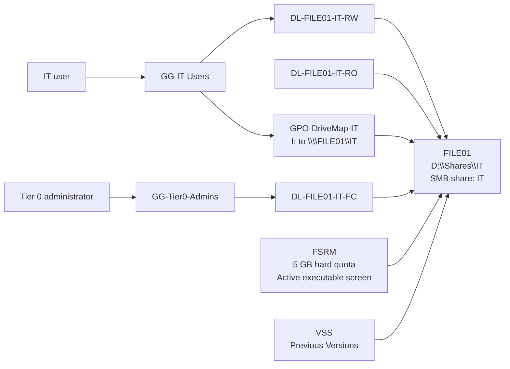

# Lab 04 — FILE01 File Services

**Date performed:** 6 October 2026

**Status:** Completed and validated

**Related AZ-802 areas:** Windows Server file services, storage, SMB, NTFS permissions, AGDLP, FSRM, Group Policy Preferences, and data recovery

## Objective

Deploy a domain-integrated Windows Server file server with separate data storage, role-based access control, storage governance, user drive mapping, and a tested previous-version recovery workflow.

## Business Scenario

The IT department needs a centrally managed file share that separates user roles from resource permissions. The service must limit uncontrolled storage growth, prevent executable files from being stored in the share, expose the share consistently to authorized users, and provide a quick recovery path for accidental file changes.

## Scope

This lab covers:

- domain join and placement of `FILE01` in the existing server OU structure;
- a dedicated 40 GB dynamically expanding data VHDX on the `HV-HOST01` `V:` datastore;
- an NTFS `D:` volume labelled `Data`;
- the File Server and File Server Resource Manager roles;
- the `D:\Shares\IT` folder and `\\FILE01\IT` SMB share;
- AGDLP-based SMB and NTFS authorization;
- a 5 GB hard quota and active executable-file screening;
- Shadow Copies, a scheduled VSS task, and a successful Previous Versions restore;
- Group Policy Preferences drive mapping from `I:` to `\\FILE01\IT` for `GG-IT-Users`.

DFS, TrueNAS integration, Azure Files, File Sync, and production backup are outside this lab and remain planned work.

## Environment

| Component | Configuration |
|---|---|
| Hyper-V host | `HV-HOST01` |
| VM datastore | `V:` ReFS volume labelled `HyperV-VMs` |
| File server | `FILE01`, joined to `ad.petrovicinfra.com` |
| Computer OU | `OU=File Servers,OU=Servers,OU=PetrovicInfra,DC=ad,DC=petrovicinfra,DC=com` |
| Data disk | 40 GB dynamically expanding VHDX on the host `V:` datastore |
| Guest data volume | `D:`, NTFS, label `Data` |
| Share folder | `D:\Shares\IT` |
| UNC path | `\\FILE01\IT` |
| Management server | `MGMT01` |
| Test user role | `GG-IT-Users` |
| Privileged role | `GG-Tier0-Admins` |

## Architecture



The authorization design follows AGDLP:

```text
Account
    -> Global role group
        -> Domain Local resource group
            -> SMB and NTFS permission
```

No direct user permissions were assigned to the share folder.

## Success Criteria

- `FILE01` is a domain member in the confirmed File Servers OU.
- The file server uses a dedicated 40 GB dynamic data disk rather than the operating-system volume.
- `D:\Shares\IT` is available as `\\FILE01\IT`.
- IT users receive access through `GG-IT-Users` and `DL-FILE01-IT-RW`.
- Tier 0 administrators receive full control through `GG-Tier0-Admins` and `DL-FILE01-IT-FC`.
- The NTFS ACL contains only the required administrative, system, and Domain Local group entries.
- The SMB ACL grants the intended Full, Change, and Read permission tiers.
- FSRM enforces a 5 GB hard quota and blocks executable files.
- VSS creates shadow copies for `D:` and a previous file version can be restored.
- Authorized IT users receive `I:` through Group Policy Preferences and can access the share through that mapping.

## Implementation

### 1. Join FILE01 to the domain and place it in the server OU

`FILE01` was joined to `ad.petrovicinfra.com`. Its computer object was moved into the existing OU path:

```text
OU=File Servers,OU=Servers,OU=PetrovicInfra,DC=ad,DC=petrovicinfra,DC=com
```

This keeps server policy scope aligned with the established OU architecture; no new OU branch was introduced.

### 2. Add and prepare the dedicated data disk

A 40 GB dynamically expanding VHDX was created on the `HV-HOST01` `V:` datastore and attached to `FILE01`. Inside the guest, the disk was initialized, partitioned, and formatted as NTFS with drive letter `D:` and volume label `Data`.

The data layout is intentionally separate from the guest operating system:

```text
FILE01
├── C:  Operating system
└── D:  Data
    └── Shares
        └── IT
```

### 3. Install file services and create the IT share

The File Server role was installed and the departmental folder was created at:

```text
D:\Shares\IT
```

The folder was published as:

```text
\\FILE01\IT
```

### 4. Implement the AGDLP authorization model

The existing Global groups represent directory roles. Resource-specific Domain Local groups represent permission levels on `FILE01`.

| Global group | Nested into | Effective resource role |
|---|---|---|
| `GG-IT-Users` | `DL-FILE01-IT-RW` | Read/write access to the IT share |
| `GG-Tier0-Admins` | `DL-FILE01-IT-FC` | Full control of the IT share |

`DL-FILE01-IT-RO` provides the read-only resource tier without introducing another unconfirmed Global group.

The resulting primary access paths are:

```text
vladimir.petrovic
    -> GG-IT-Users
        -> DL-FILE01-IT-RW
            -> SMB Change + NTFS Modify

adm-vpetrovic
    -> GG-Tier0-Admins
        -> DL-FILE01-IT-FC
            -> SMB Full + NTFS Full Control
```

### 5. Clean the NTFS ACL

Default broad entries were removed from the share root. The resulting ACL retained only the required principals and permission tiers.

| Principal | NTFS permission |
|---|---|
| `BUILTIN\Administrators` | Full Control |
| `NT AUTHORITY\SYSTEM` | Full Control |
| `PETROVIC\DL-FILE01-IT-FC` | Full Control |
| `PETROVIC\DL-FILE01-IT-RW` | Modify |
| `PETROVIC\DL-FILE01-IT-RO` | Read & Execute |

The ACL is resource-group based: access is not assigned directly to individual users.

### 6. Configure SMB permissions

The share permissions mirror the three Domain Local resource tiers.

| Principal | SMB permission |
|---|---|
| `PETROVIC\DL-FILE01-IT-FC` | Full |
| `PETROVIC\DL-FILE01-IT-RW` | Change |
| `PETROVIC\DL-FILE01-IT-RO` | Read |

Effective network access is the most restrictive combination of SMB and NTFS permissions.

### 7. Configure FSRM quota and file screening

File Server Resource Manager was installed. A 5 GB hard quota was applied to `D:\Shares\IT`. Because the quota is hard, writes are blocked when the limit is reached instead of only generating a warning.

An active file screen was created by using the built-in `Executable Files` file group:

```powershell
New-FsrmFileScreen `
    -Path "D:\Shares\IT" `
    -IncludeGroup "Executable Files" `
    -Active `
    -Description "Block executable files on IT share"
```

The active screen controls file types independently of identity permissions: AGDLP determines who can write, while FSRM determines which file types may be stored.

### 8. Enable Shadow Copies and schedule VSS snapshots

Shadow storage for `D:` was configured on the same volume with a 4 GB maximum:

```powershell
vssadmin add shadowstorage /for=D: /on=D: /maxsize=4GB
vssadmin create shadow /for=D:
```

The scheduled task `FILE01-Daily-ShadowCopies` runs as `SYSTEM` with highest privileges and creates two snapshots per day:

```text
08:00
18:00
```

The task action runs:

```text
vssadmin.exe create shadow /for=D:
```

### 9. Map the IT share through Group Policy Preferences

The GPO `GPO-DriveMap-IT` was linked to the existing `OU=PetrovicInfra` scope. The drive map is configured under:

```text
User Configuration
└── Preferences
    └── Windows Settings
        └── Drive Maps
```

| Setting | Value |
|---|---|
| Action | Update |
| Location | `\\FILE01\IT` |
| Label | `IT` |
| Drive letter | `I:` |
| Reconnect | Enabled |
| Item-level targeting | User is a member of `PETROVIC\GG-IT-Users` |

The GPO retained normal `Authenticated Users` security filtering. Item-level targeting controls which users receive the mapping.

## Validation

| Test | Expected result | Observed result | Status |
|---|---|---|---|
| Domain and OU placement | `FILE01` is a domain member in the File Servers OU | Confirmed in the established OU path | PASS |
| Data storage | Dedicated 40 GB dynamic VHDX is exposed as NTFS `D:` / `Data` | Volume available and used for share data | PASS |
| SMB availability | `\\FILE01\IT` is reachable | Share opened successfully | PASS |
| RW authorization | IT user can create and read a file through the AGDLP chain | User write/read test succeeded | PASS |
| FSRM allowed type | A normal text file can be created | `.txt` creation succeeded | PASS |
| FSRM blocked type | An executable file is rejected | `.exe` creation was blocked | PASS |
| VSS | A shadow copy for `D:` is present | Snapshot created successfully | PASS |
| Previous Versions | Version 1 can be restored after the file is changed to Version 2 | Restore completed successfully | PASS |
| GPO mapping | Authorized user receives `I:` mapped to `\\FILE01\IT` | Mapping appeared and was usable | PASS |

The confirmed end-to-end user path is:

```text
GG-IT-Users
    -> GPO-DriveMap-IT
        -> I: / \\FILE01\IT
            -> DL-FILE01-IT-RW
                -> SMB Change + NTFS Modify
```

The explicit read-only negative test—read succeeds while create, modify, and delete fail—was not captured in this session. The `DL-FILE01-IT-RO` tier is configured, but this boundary should be retained as a regression test when another standard test account is available.

## Security and Safety Notes

- Access is assigned to Domain Local resource groups, not directly to users.
- Standard and privileged identities use separate Global groups and separate permission paths.
- Broad default NTFS entries were removed from the share root.
- Active file screening reduces the risk of storing executable content but is not malware protection.
- Shadow Copies are stored on the same `D:` disk as live data. They support rapid recovery from accidental changes but do not replace an independent backup.
- Credentials, VM disks, and unsanitized exports are not stored in this repository.

## Lessons Learned

- AGDLP keeps organizational roles independent from resource-specific permissions and makes the ACL easier to audit.
- SMB and NTFS permissions must be designed together because effective network access is the more restrictive result.
- Separating the data VHDX from the operating-system disk simplifies capacity management and future recovery work.
- FSRM quotas and file screening address different controls: capacity and allowed file types.
- Group Policy Preferences with item-level targeting can provide a consistent drive letter without changing GPO security filtering.
- Previous Versions is useful for fast user-file recovery, but same-disk VSS storage does not protect against loss of the data disk.

## Limitations

- The file server, domain controller, and management server share one physical Hyper-V host; this is not host-level high availability.
- VSS snapshots and live files currently share the same virtual data disk.
- The 5 GB quota is a lab-scale policy rather than a production capacity recommendation.
- The read-only permission tier still needs a separately recorded negative-access regression test.
- DFS, independent backup, TrueNAS storage, monitoring, and file-service failover remain outside this completed sublab.

## Next Step

Proceed to DHCP: install and authorize the role, create the first scope, configure exclusions or reservations and options `003`, `006`, and `015`, then validate address leasing and administration through PowerShell.
