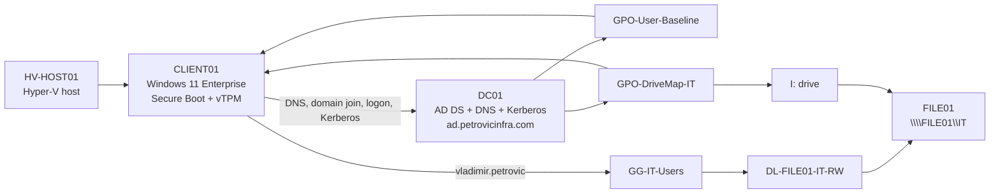

# Lab 05 — CLIENT01 Windows 11 Enterprise Domain Integration

**Date completed:** 10 October 2026

**Status:** Completed and validated

**Related AZ-802 areas:** Hyper-V virtual machines, Active Directory Domain Services, DNS, Kerberos, Group Policy, Group Policy Preferences, and role-based file access

## Objective

Deploy a Windows 11 Enterprise workstation on the existing Hyper-V platform and prove that it operates as a fully integrated enterprise client in the `ad.petrovicinfra.com` domain.

## Business Scenario

The environment needs a standard user workstation that receives identity, policy, and file-service configuration from the existing Windows Server infrastructure. The client must use the internal domain controller for DNS and Kerberos, reside in the standard workstation OU, enforce the established user restrictions, and provide the IT file share through the existing AGDLP authorization model.

## Scope

This lab covers:

- deployment of the `CLIENT01` Windows 11 Enterprise virtual machine on `HV-HOST01`;
- Generation 2 security features, including Secure Boot and virtual TPM;
- DNS configuration pointing to `DC01`;
- domain join to `ad.petrovicinfra.com` (`PETROVIC`);
- placement in `OU=Standard,OU=Workstations,OU=PetrovicInfra,DC=ad,DC=petrovicinfra,DC=com`;
- interactive sign-in as `PETROVIC\vladimir.petrovic` and RDP validation;
- Kerberos authentication through `DC01.ad.petrovicinfra.com`;
- application of `GPO-User-Baseline` and `GPO-DriveMap-IT`;
- validation of the `I:` drive mapping to `\\FILE01\IT`;
- validation of the existing `GG-IT-Users` to `DL-FILE01-IT-RW` AGDLP path;
- validation that Command Prompt, Run, and Control Panel restrictions are enforced.

Windows LAPS, Defender Firewall, advanced auditing, local administrator group management, and PowerShell logging are intentionally reserved for a separate workstation security baseline lab.

## Existing Environment

| Component | Role in this lab |
|---|---|
| `HV-HOST01` | Windows Server 2025 Datacenter Core Hyper-V host for `CLIENT01` |
| `DC01` | AD DS, DNS, Kerberos KDC, and Group Policy for `ad.petrovicinfra.com` |
| `MGMT01` | Existing domain management workstation with RSAT and GPMC |
| `FILE01` | Hosts the `\\FILE01\IT` SMB share |
| `CLIENT01` | Windows 11 Enterprise domain workstation |
| Domain | `ad.petrovicinfra.com` |
| NetBIOS name | `PETROVIC` |
| Workstation OU | `OU=Standard,OU=Workstations,OU=PetrovicInfra,...` |
| Test identity | `PETROVIC\vladimir.petrovic` |

The client IP address and detailed virtual hardware allocation were not captured as final evidence, so they are deliberately not asserted here.

## Architecture



## Implementation Summary

### 1. Deploy the workstation VM

`CLIENT01` was deployed on `HV-HOST01` as a Windows 11 Enterprise virtual machine. Secure Boot and a virtual TPM were enabled to provide the expected Windows 11 Generation 2 security baseline.

### 2. Configure domain DNS and join Active Directory

The client was configured to use `DC01` as its DNS server, then joined to:

```text
ad.petrovicinfra.com
```

The computer account was placed in the existing standard workstation path:

```text
OU=Standard,OU=Workstations,OU=PetrovicInfra,DC=ad,DC=petrovicinfra,DC=com
```

No new OU, group, share, or GPO was created for this lab.

### 3. Validate domain sign-in and Kerberos

The standard domain account `PETROVIC\vladimir.petrovic` signed in successfully. RDP access to the client was confirmed. Kerberos ticket inspection showed a valid ticket-granting ticket and identified `DC01.ad.petrovicinfra.com` as the Key Distribution Center.

### 4. Validate Group Policy processing

The existing user-side policies were processed on `CLIENT01`:

- `GPO-User-Baseline` enforced the expected user restrictions;
- `GPO-DriveMap-IT` delivered the departmental file-share mapping.

The restrictions were tested directly: Command Prompt, Run, and Control Panel were unavailable to the standard user as designed.

### 5. Validate file-service integration

`GPO-DriveMap-IT` mapped:

```text
I: -> \\FILE01\IT
```

The mapped drive was accessible. Authorization continued to use the existing AGDLP chain:

```text
vladimir.petrovic
    -> GG-IT-Users
        -> DL-FILE01-IT-RW
            -> SMB Change + NTFS Modify on \\FILE01\IT
```

The user also retained `DL-MGMT01-RDP` in the security token, consistent with the previously implemented RDP authorization model.

## Validation Evidence

| Test | Observed result | Status |
|---|---|---|
| Windows edition | `CLIENT01` runs Windows 11 Enterprise | PASS |
| VM security | Secure Boot and virtual TPM are enabled | PASS |
| Domain join | Client joined `ad.petrovicinfra.com` | PASS |
| OU placement | Computer object is in the Standard workstation OU | PASS |
| Domain sign-in | `PETROVIC\vladimir.petrovic` signed in successfully | PASS |
| Remote access | RDP connection to `CLIENT01` succeeded | PASS |
| Kerberos | Valid TGT present; KDC is `DC01.ad.petrovicinfra.com` | PASS |
| User baseline | `GPO-User-Baseline` applied | PASS |
| Drive mapping | `GPO-DriveMap-IT` applied and created `I:` | PASS |
| File access | `I:` opened `\\FILE01\IT` successfully | PASS |
| Authorization | `GG-IT-Users` to `DL-FILE01-IT-RW` membership path present | PASS |
| User restrictions | Command Prompt, Run, and Control Panel were blocked | PASS |

## Security and Design Notes

- The workstation uses internal AD DNS rather than a public resolver for domain operations.
- Authentication was verified as Kerberos-based through the domain controller.
- File access is granted through group nesting; no new direct user ACL was introduced.
- The client reuses the established OU, GPO, and FILE01 authorization design instead of duplicating resources.
- This lab validates a client running on the same physical Hyper-V host as the server VMs; it does not demonstrate host-level availability.
- Passwords, ticket contents, VM disks, ISO images, and other sensitive or large artifacts are not stored in the repository.

## Completion and Follow-up

The deployment and integration objectives are complete. `CLIENT01` is a working Windows 11 Enterprise domain workstation with validated DNS, domain authentication, Kerberos, Group Policy, file mapping, and user restrictions.

The Windows installation ISO was removed from the virtual DVD drive and a clean-state checkpoint named `DomainJoined-Baseline` was created after validation.

A Hyper-V checkpoint is a short-term lab rollback point, not a backup. Workstation security hardening will be documented separately, beginning with Windows LAPS.
